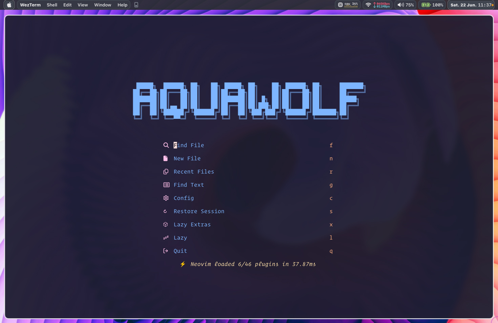
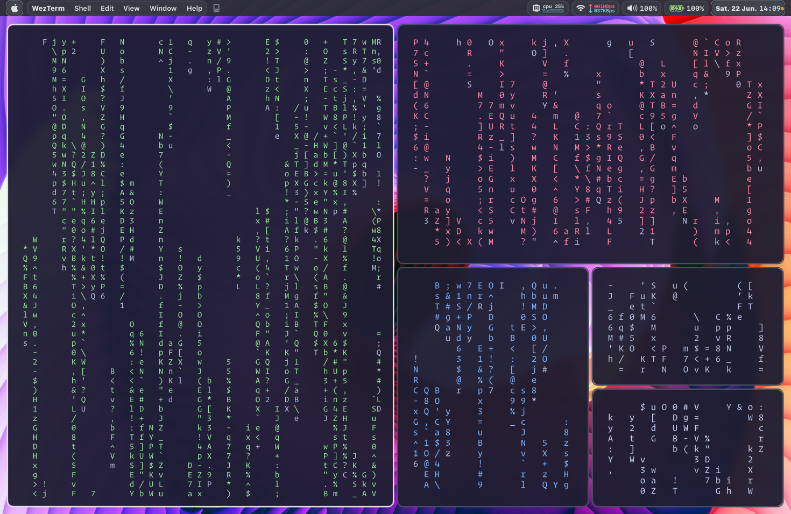
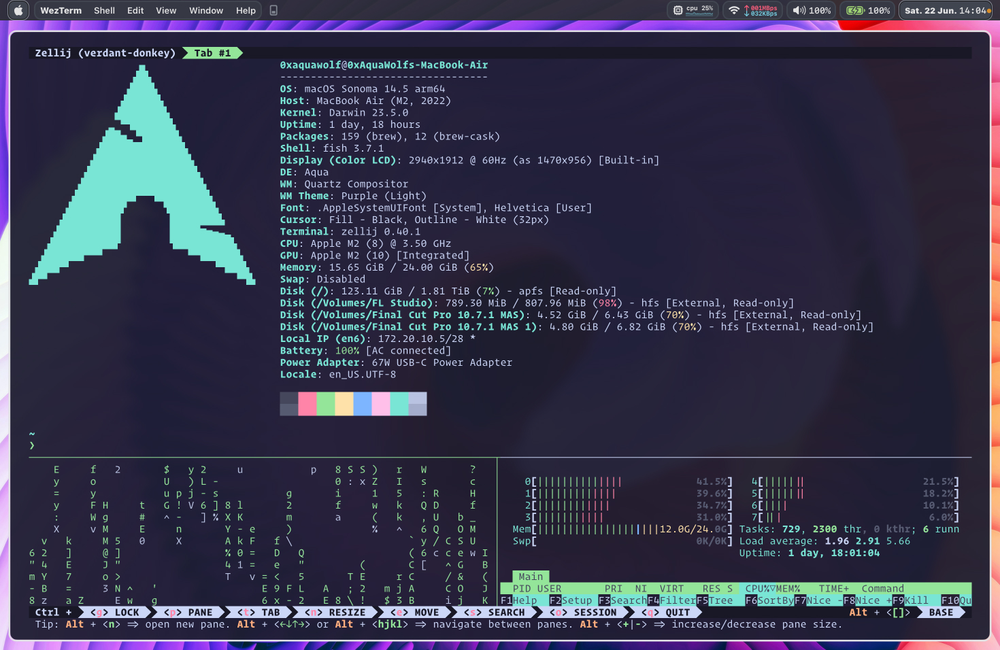
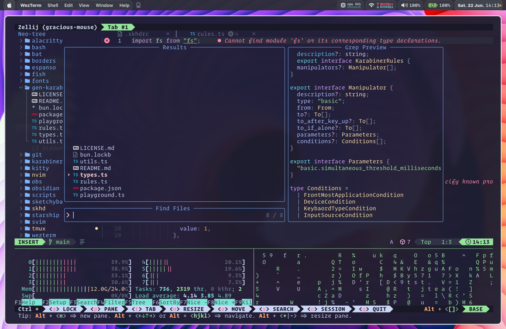
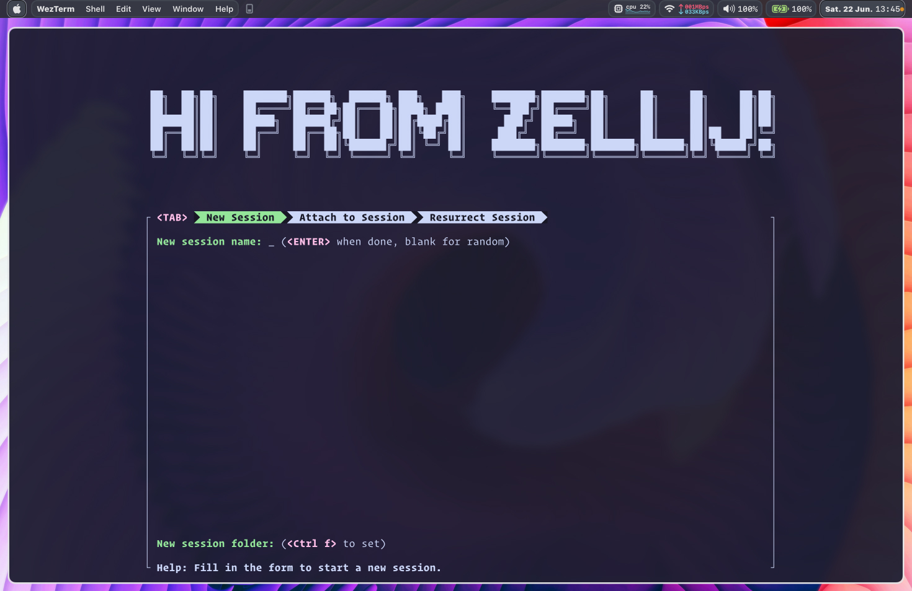

# AquaFiles (dotfiles)

> Plain text configs for bootstrapping my (PDE) Personal Development Enviroment.

My primary operating system is macOS, but I do use Linux sometimes... (arch, btw!)

**Feel free to try out my dotfiles or use them as inspiration!** If you have a
suggestion, improvement or question, please open an issue or PR!

<!-- ## Demo Video (coming soon) -->

## Design Principles

- [Open-Source](https://opensource.org/osd)
- [Flow State](<https://en.wikipedia.org/wiki/Flow_(psychology)>)
- [Minimalism](https://en.wikipedia.org/wiki/Minimalism)
- [Keyboard Home Row Centric](https://en.wikipedia.org/wiki/Touch_typing#Home_row)
- [Design & Aesthetics](https://en.wikipedia.org/wiki/Design)
- [Productivity (minimize distractions)](https://en.wikipedia.org/wiki/Productivity#Productivity_improving_technologies)
- [Form & Function (beauty and action)](https://en.wikipedia.org/wiki/Form_follows_function)
- [Portable](https://en.wikipedia.org/wiki/Portable_computing)
- [Bleeding Edge](https://en.wikipedia.org/wiki/Bleeding_edge_technology)

## Screenshots

> Lazyvim Welcome screen



> Yabai bsp grid with 5 cmatrix running



> Zellij fastfetch, cmatrix, htop



> Zellij Neovim htop cmatrix



> Zellij welcome screen



<table>
  <tr>
    <td>
      
      <b>WARNING</b>
    </td>
  </tr>
  <tr>
    <td colspan="2">
      <b>These dotfiles are for my own personal use and i update them very frequently. If you want to use them: fork the repo, review the code and take what you need from it. Use at your own risk!
      </b>
    </td>
  </tr>
</table>

### Requirements

- [Deno](https://deno.land)
- Neovim >= **0.9.0** (needs to be built with **LuaJIT**)
- Git >= **2.19.0** (for partial clones support)
- [LazyVim](https://www.lazyvim.org/)
- a [Nerd Font](https://www.nerdfonts.com/)(v3.0 or greater) **_(optional, but needed to display some icons, Patched Operator Mono Provided in the repo)_**
- [lazygit](https://github.com/jesseduffield/lazygit) **_(optional)_**
- a **C** compiler for `nvim-treesitter`. See [here](https://github.com/nvim-treesitter/nvim-treesitter#requirements)
- for [telescope.nvim](https://github.com/nvim-telescope/telescope.nvim) **_(optional)_**
  - **live grep**: [ripgrep](https://github.com/BurntSushi/ripgrep)
  - **find files**: [fd](https://github.com/sharkdp/fd)
- a terminal that support true color and *undercurl*:
  - [kitty](https://github.com/kovidgoyal/kitty) **_(Linux & Macos)_**
  - [wezterm](https://github.com/wez/wezterm) **_(Linux, Macos & Windows)_**
- [Patched Operator Mono](https://github.com/0xAquaWolf/AquaFiles/tree/main/fonts)
  - Added Nerd Fonts
  - Added Ligatures

<!-- ### macOS setup -->

### WezTerm Setup

install wezterm through homebrew

```bash
brew install --cask wezterm
```

- `cd` into AquaFiles

```bash
cd ~/AquaFiles/
```

- stow the config

```bash
stow wezterm
```

### Fish Shell Setup

- install fish shell through homebrew

```bash
brew install fish
```

- Add fish to the list of allowed shells by appending its path to /etc/shells

```bash
echo $(which fish) | sudo tee -a /etc/shells
```

- set fish shell to the default shell

```bash
chsh -s /opt/homebrew/bin/fish
```

- exit the current terminal

```bash
exit
```

- check if fish shell is set as the default shell

```bash
echo $SHELL
# expected output:
# /opt/homebrew/bin/fish (if on macOS)
```

- delete config folder

```bash
rm -rf ~/.config/fish
```

- `cd` into AquaFiles

```bash
cd ~/AquaFiles/
```

- stow the config

```bash
stow fish
```

**Troubleshooting**: if you don't see a recently added path in the $PATH make sure to delete `~/.config/fish/fish_variables`, and exit the terminal and restart to clear the cache

### Neovim setup

- install deno for (peek.nvim)

```bash
curl -fsSL https://deno.land/install.sh | sh
```

- Backup previous config

```bash
mv ~/.config/nvim ~/.config/nvim.bak
mv ~/.local/share/nvim ~/.local/share/nvim.bak
```

- Install LazyVim

```
git clone https://github.com/LazyVim/starter ~/.config/nvim
```

- Remove the .git folder, so you can add it to your own repo later

```bash
rm -rf ~/.config/nvim/.git
```

- install deno for peek.nvim

```bash
curl -fsSL https://deno.land/install.sh | sh
```

- clone dotfiles _(needs to be cloned in root directory for GNU Stow work)_

```bash
git clone https://github.com/0xAquaWolf/AquaFiles ~/
```

- delete lua directory in nvim

```bash
rm -rf ~/.config/nvim/lua/*
```

- `cd` into AquaFiles

```bash
cd ~/AquaFiles/
```

- if on macOS (you might need to delete DS_Store files)

```bash
dir="${1:-.}" && echo "Removing .DS_STORE files from $dir" && find "$dir" -type f -name .DS_STORE -delete && echo "ALL .DS_STORE files have been removed from $dir"
```

- stow lazyvim

```bash
stow nvim
```

- startup neovim

```bash
nvim
```

- sit back and enjoy the installation

### Git setup

- `cd` into AquaFiles

```bash
cd ~/AquaFiles/
```

- `stow` git

```bash
stow git
```

### Zellij setup

- `cd` into AquaFiles

```bash
cd ~/AquaFiles/
```

- `stow` zellij

```bash
stow zellij
```

### Yabai Setup

#### Disable System Integrity Protection

1. Turn off your device
2. **Intel [(apple docs)](https://support.apple.com/en-gb/guide/mac-help/mchl338cf9a8/12.0/mac/12.0):**  
   Hold down <kbd>command ⌘</kbd>+<kbd>R</kbd> while booting your device.
   **Apple Silicon [(apple docs)](https://support.apple.com/en-gb/guide/mac-help/mchl82829c17/12.0/mac/12.0):**  
   Press and hold the power button on your Mac until “Loading startup options” appears.  
   Click Options, then click Continue.
3. In the menu bar, choose `Utilities`, then `Terminal`
4. Disable System Integrity Protection

```bash
#
# APPLE SILICON
#

# If you're on Apple Silicon macOS 13.x.x OR newer
# Requires Filesystem Protections, Debugging Restrictions and NVRAM Protection to be disabled
# (printed warning can be safely ignored)
csrutil enable --without fs --without debug --without nvram

# If you're on Apple Silicon macOS 12.x.x
# Requires Filesystem Protections, Debugging Restrictions and NVRAM Protection to be disabled
# (printed warning can be safely ignored)
csrutil disable --with kext --with dtrace --with basesystem

#
# INTEL
#

# If you're on Intel macOS 11.x.x OR newer
# Requires Filesystem Protections and Debugging Restrictions to be disabled (workaround because --without debug does not work)
# (printed warning can be safely ignored)
csrutil disable --with kext --with dtrace --with nvram --with basesystem
```

5. Reboot
6. For Apple Silicon; enable non-Apple-signed arm64e binaries

```
# Open a terminal and run the below command, then reboot
sudo nvram boot-args=-arm64e_preview_abi
```

7. You can verify that System Integrity Protection is turned off by running `csrutil status`, which returns `System Integrity Protection status: disabled.` if it is turned off (it may show `unknown` for newer versions of macOS when disabling SIP partially).

If you ever want to re–enable System Integrity Protection after uninstalling yabai; repeat the steps above, but run `csrutil enable` instead at step 4.

#### Configure Scripting Additions

_Why do you need scripting additions?_

**yabai** uses the macOS Mach APIs to inject code into Dock.app; this requires elevated (root) privileges.
You can configure your user to execute _yabai --load-sa_ as the root user without having to enter a password.
To do this, we add a new configuration entry that is loaded by _/etc/sudoers_.

```bash
# create a new file for writing - visudo uses the vim editor by default.
# go read about this if you have no idea what is going on.

sudo visudo -f /private/etc/sudoers.d/yabai

# input the line below into the file you are editing.
#  replace <yabai> with the path to the yabai binary (output of: which yabai).
#  replace <user> with your username (output of: whoami).
#  replace <hash> with the sha256 hash of the yabai binary (output of: shasum -a 256 $(which yabai)).
#   this hash must be updated manually after upgrading yabai.

<user> ALL=(root) NOPASSWD: sha256:<hash> <yabai> --load-sa
```

If you know what you are doing, the following one-liner can be used to update the sudoers file correctly:

```bash
echo "$(whoami) ALL=(root) NOPASSWD: sha256:$(shasum -a 256 $(which yabai) | cut -d " " -f 1) $(which yabai) --load-sa" | sudo tee /private/etc/sudoers.d/yabai
```

After the above edit has been made, add the command to load the scripting addition at the top of your yabairc config file

```bash
# for this to work you must configure sudo such that
# it will be able to run the command without password

yabai -m signal --add event=dock_did_restart action="sudo yabai --load-sa"
sudo yabai --load-sa
```

lastly make sure to uncomment the last line from the sudoers file

`sudo visudo -f /private/etc/sudoers`

it should read

`#includedir /private/etc/sudoers.d` (sometimes it has 2 ## it should only have 1)

finnaly _**reboot**_ your mac

#### Test Scripting Additions

```bash
yabai -m space --focus recent
```

_the intented result should be that you change your window focus, if not you did not correctly add the scripting additions_

#### stow config

- `cd` into AquaFiles

```bash
cd ~/AquaFiles/
```

- `stow` yabai

```bash
stow yabai
```

- `start` yabai service

```bash
yabai --start-service
```

### skhd setup

- `start` service

```bash
skhd --start-service
```

- `cd` into AquaFiles

```bash
cd ~/AquaFiles/
```

- `stow` zellij

```bash
stow skhd
```

  <!-- ### yabai setup -->

## Live Streaming on YouTube

Chronicling my journey of continuous learning and exploration in cutting-edge technologies including:

- Algo Trading
- Web3
- AI/ML

Join me as I document my growth, share insights, and delve into the ever-evolving world of tech innovation.
<br />
<br />
[0xAquaWolf YouTube Channel](https://youtube.com/playlist?list=PLwbt1uBf9iqArccoEXrIB_ZO0d86rECgc&si=GRBhNj0w_ZW4XwIt)

<!-- Add an image that is clickable that links to my channel -->

## Apps i use

### MacOS (Content creation, Writing, Programming)

- [Wezterm](https://wezfurlong.org/wezterm/) - Terminal
- [Homebrew](https://brew.sh/) - Package manager
- [Raycast](https://www.raycast.com/) - App Launcher
- [Obsidian](https://obsidian.md/) - Sync through iCloud
- [Yabai](https://github.com/koekeishiya/yabai) - Window Manager
- [SKHD](https://github.com/koekeishiya/skhd) - Keyboard Shortcut Manager
- [Karabiner Elements](https://karabiner-elements.pqrs.org/) - Hypermod and sublayers
- [Shortcat](https://shortcatapp.com/) - Vim for the desktop
- [KeyCastr](https://github.com/keycastr/keycastr) - For keyboard casting of shortcuts
- Visual Studio Code (with vim like settings, check the repo)
  - [Vim](https://marketplace.visualstudio.com/items?itemName=vscodevim.vim) (Vim motions FTW!!!!)
  - [Catppuccin for VSCode](https://marketplace.visualstudio.com/items?itemName=Catppuccin.catppuccin-vsc)
  - [Catppuccin Icons for VSCode](https://marketplace.visualstudio.com/items?itemName=Catppuccin.catppuccin-vsc-icons)
  - [Clock in status bar](https://marketplace.visualstudio.com/items?itemName=compulim.vscode-clock) (Hide ENV Variables on stream)
  - [Code Runner](https://marketplace.visualstudio.com/items?itemName=formulahendry.code-runner)
  - [DotENV](https://marketplace.visualstudio.com/items?itemName=mikestead.dotenv)
  - [Cloak](https://marketplace.visualstudio.com/items?itemName=johnpapa.vscode-cloak) (HIDE ENV for streaming)
  - [TODO Highlight](https://marketplace.visualstudio.com/items?itemName=wayou.vscode-todo-highlight)
  - [Rainbow CSV](https://marketplace.visualstudio.com/items?itemName=mechatroner.rainbow-csv)
  - [Data Wrangler](https://marketplace.visualstudio.com/items?itemName=ms-toolsai.datawrangler)
  - [Even Better TOML](https://marketplace.visualstudio.com/items?itemName=tamasfe.even-better-toml)
  - [Markdown Preview Enhanced](https://marketplace.visualstudio.com/items?itemName=shd101wyy.markdown-preview-enhanced)
  - [Markdown Checkboxes](https://marketplace.visualstudio.com/items?itemName=bierner.markdown-checkbox)
  - Python Dev Env
    - [Python](https://marketplace.visualstudio.com/items?itemName=ms-python.python) (Includes Python Debugger)
    - [Pylance](https://marketplace.visualstudio.com/items?itemName=ms-python.vscode-pylance) (LSP)
    - [Black Formatter](https://marketplace.visualstudio.com/items?itemName=ms-python.black-formatter)
    - [Jupyter](https://marketplace.visualstudio.com/items?itemName=ms-toolsai.jupyter) (Includes Jupyter Notebook support)
      - [Jupyter Cell Tags](https://marketplace.visualstudio.com/items?itemName=ms-toolsai.vscode-jupyter-cell-tags)
      - [Jupyter Keymap](https://marketplace.visualstudio.com/items?itemName=ms-toolsai.jupyter-keymap)
      - [Jupyter Notebook Renderers](https://marketplace.visualstudio.com/items?itemName=ms-toolsai.jupyter-renderers)
      - [Jupyter Slide Show](https://marketplace.visualstudio.com/items?itemName=ms-toolsai.vscode-jupyter-slideshow)

### Chrome Extensions

- [Vimium](https://vimium.github.io/)
- [Wappalyzer](https://www.wappalyzer.com/)
- [Dark Reader](https://darkreader.org/) - with Catppuccin Mocha theme
- [uBlock Origin](https://ublockorigin.com/)
- [1Password](https://1password.com/)
- [Undistracted](https://undistracted.app/)
- [Bypass Paywalls](https://github.com/iamadamdev/bypass-paywalls-chrome)

### Desktop Apps

- [Ableton Live 12](https://www.ableton.com/en/live/) - DAW
- [Affinity Photo](https://affinity.serif.com/en-us/photo/) - Professional image editing software
- [Android File Transfer](https://www.android.com/filetransfer/) - File transfer tool for Android devices
- [Binaural](https://apps.apple.com/us/app/binaural-beats-generator/id1487743559) - Binaural beats generator
- [LuLu](https://objective-see.org/products/lulu.html) - Security and network traffic blocker
- [CleanShot X](https://cleanshot.com/) - Advanced screenshot and screen recording tool
- [Gestimer](http://maddin.io/gestimer/) - Simple menubar timer
- [IINA](https://iina.io/) - Modern video player
- [KeyboardCleanTool](https://folivora.ai/keyboardcleantool) - Tool to clean your keyboard
- [Audio Hijack](https://rogueamoeba.com/audiohijack/) - Advanced audio recording software
- [Memory Clean 3](https://fiplab.com/apps/memory-clean-for-mac) - Memory optimization tool
- [Parallels](https://www.parallels.com/) - Virtual machine software
- [CrossOver](https://www.codeweavers.com/crossover) - Run Windows applications on macOS
- [Rize](https://rize.io/) - Productivity tracker for macOS
- [Screen Studio](https://www.screen.studio/) - Screen recording and editing tool
- [ScreenFlow](https://www.telestream.net/screenflow/) - Screen recording and video editing software
- [TablePlus](https://tableplus.com/) - Database manager
- [The Unarchiver](https://theunarchiver.com/) - File extraction utility
- [xScope](https://xscopeapp.com/) - Set of tools for UI/UX Designers
- [Bartender 5](https://www.macbartender.com/) - macOS Menubar management
- [Keka](https://www.keka.io/) - File compression and extraction
- [Voicemod](https://www.voicemod.net/) - Real-time voice changer
- [OBS](https://obsproject.com/) - Open source video recording and live streaming
- [Kaleidoscope](https://kaleidoscope.app/) - File and image comparison tool
- [AlDente](https://github.com/davidwernhart/AlDente) - macOS Battery Manager
- [Dynamic Wallpaper](https://apps.apple.com/us/app/dynamic-wallpaper/id1453504509) - Wallpaper changer for macOS
- [ColorSlurp](https://colorslurp.com/) - Color picker and organizer
- [Elgato Stream Deck](https://www.elgato.com/en/stream-deck) - Customizable control panel
- [Farrago](https://rogueamoeba.com/farrago/) - Soundboard for macOS
- [iTubeGo](https://itubego.com/) - YouTube video downloader

## Join the Community on Discord

AquaWolf Academy: https://discord.gg/wzPBjEcn87

## Todo List

<!-- Explain that i'm using GNU Stow for my dotfiles and how it works -->

- [x] add links for apps i use
- [x] neovim setup
- [x] fish setup
- [x] git setup
- [x] Zellij setup
- [x] skhd setup
- [x] yabai setup
- [ ] obsidian setup & config
- [ ] document how to use GNU Stow with my dotfiles
- [ ] add a quick start guide (use this for video)
- [ ] add a video showing how to bootstrap the install and using the config
<!-- - [ ] karabiners setup -->
